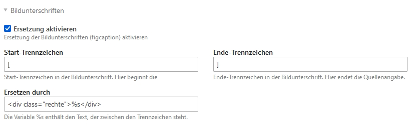

# Bildunterschriften ersetzen für Contao

Diese Erweiterung schneidet aus Bildunterschriften einen von Trennzeichen umklammerten Text heraus und
setzt ihn – in eine frei wählbare HTML-Vorlage verpackt – als eigenen Block an den Anfang der
Bildunterschrift. Damit lässt sich zum Beispiel der Fotograf oder eine Quellenangabe gesondert
auszeichnen, ohne dass dafür ein eigenes Feld oder ein eigenes Template nötig wäre.

Die Bildunterschrift wird dabei so gepflegt, wie sie sich am natürlichsten schreibt – die
Quellenangabe steht mitten im Satz und wird von der Erweiterung automatisch herausgelöst.

* **Voraussetzungen:** Contao 4.13 LTS oder Contao 5, PHP 8.1 oder neuer
* **Lizenz:** LGPL-3.0-or-later

## Installation

Über den Contao Manager nach `contao-figcaption-bundle` suchen und installieren, oder auf der
Kommandozeile:

```bash
composer require schachbulle/contao-figcaption-bundle
```

Anschließend den Contao-Cache leeren (Contao Manager → Wartung → Anwendungs-Cache neu aufbauen, oder
`vendor/bin/contao-console cache:clear`). Eine Datenbank-Migration ist nicht nötig, die Erweiterung
legt keine Tabellen an.

## Einstellungen

Die Erweiterung wird im Backend unter **System → Einstellungen** im Abschnitt *Bildunterschriften*
konfiguriert:



| Einstellung | Bedeutung | Voreinstellung |
| --- | --- | --- |
| **Ersetzung aktivieren** | Schaltet die Erweiterung global ein oder aus. Ist der Haken nicht gesetzt, bleiben alle Bildunterschriften unverändert – auch die bereits gepflegten Trennzeichen bleiben dann sichtbar im Text stehen. | aktiv |
| **Start-Trennzeichen** | Zeichen oder Zeichenfolge, an der die Quellenangabe beginnt. | `[` |
| **Ende-Trennzeichen** | Zeichen oder Zeichenfolge, an der die Quellenangabe endet. | `]` |
| **Ersetzen durch** | HTML-Vorlage für die Ausgabe. Der Platzhalter `%s` wird durch den Text zwischen den Trennzeichen ersetzt. | `<div class="rechte">%s</div>` |
| **Position der Quellenangabe** | Ob die Quellenangabe in der Bildunterschrift bleibt oder aus ihr herausgelöst und direkt hinter das Bild gesetzt wird – siehe [Position der Quellenangabe](#position-der-quellenangabe). | In der Bildunterschrift |

Die vier unteren Felder erscheinen erst, wenn *Ersetzung aktivieren* angehakt ist. Alle
Einstellungen gelten für die gesamte Installation; eine Einstellung pro Seite oder pro
Inhaltselement gibt es nicht.

## Verwendung

Die Quellenangabe wird direkt in die Bildunterschrift geschrieben – dort, wo sie inhaltlich
hingehört. Bildunterschriften pflegt man in Contao je nach Kontext an unterschiedlichen Stellen,
zum Beispiel:

* Inhaltselement **Bild** → Feld *Bildunterschrift*
* Inhaltselement **Bildergalerie** → Bildunterschrift der einzelnen Datei
* **Nachrichten**, **Events**, **Formulare** und eigene Elemente, sofern deren Template ein
  `<figcaption>` ausgibt
* Dateiverwaltung → Metadaten einer Datei, Feld *Bildunterschrift*

### Beispiel

Eingabe im Backend:

```
Links steht Hans Mustermann,[Holger Mustermann] rechts Berta Mustermann.
```

Ausgabe im Frontend (mit der Standard-Vorlage `<div class="rechte">%s</div>`):

```html
<figcaption class="caption">
    <div class="rechte">Holger Mustermann</div>Links steht Hans Mustermann, rechts Berta Mustermann.
</figcaption>
```

Der umklammerte Text wird also an seiner ursprünglichen Stelle **entfernt** und dem Rest der
Bildunterschrift **vorangestellt**. Das ist Absicht: Die Standard-Vorlage ist ein eigenes
Block-Element, das per CSS unabhängig vom Fließtext positioniert wird.

Wo genau die Quellenangabe erscheint, entscheidet also das Stylesheet, nicht die Erweiterung. Wird
sie – wie beim Deutschen Schachbund – absolut positioniert, ist ihre Stelle im Quelltext für die
Darstellung ohnehin bedeutungslos:

```css
.image_container {
    position: relative;
}

.image_container .rechte {
    position: absolute;
    right: 0;
    bottom: 0;
    width: 100%;
    padding: 18px 5px 5px;
    font-size: 12px;
    line-height: 14px;
    color: #fff;
    text-align: right;
    pointer-events: none;
    opacity: 0;
    transition: 0.4s ease-in-out;
}

/* Quellenangabe erst beim Überfahren des Bildes einblenden */
.image_container:hover .rechte {
    opacity: 1;
    background-image: linear-gradient(rgba(2, 97, 152, 0) 0%, rgb(0, 37, 51) 100%);
}

.image_container .rechte::before {
    content: "© ";
}
```

Schlichter geht es auch: Mit `float: right; margin-left: 1em;` läuft die Bildunterschrift um die
Quellenangabe herum, mit `display: block; text-align: right;` steht sie in einer eigenen Zeile.

### Position der Quellenangabe

Über die Einstellung *Position der Quellenangabe* lässt sich umschalten, wohin die fertige
Ersetzung geschrieben wird.

**In der Bildunterschrift** (Voreinstellung) – die Quellenangabe bleibt innerhalb des
`<figcaption>`-Elements:

```html
<figure class="image_container">
    <a href="gross.jpg"></a>
    <figcaption class="caption">
        <div class="rechte">Holger Mustermann</div>Links steht Hans, rechts Berta.
    </figcaption>
</figure>
```

**Vor der Bildunterschrift, direkt hinter dem Bild** – die Quellenangabe wird aus der
Bildunterschrift herausgelöst und als eigenständiges Element in die `<figure>` gesetzt:

```html
<figure class="image_container">
    <a href="gross.jpg"></a>
    <div class="rechte">Holger Mustermann</div>
    <figcaption class="caption">Links steht Hans, rechts Berta.</figcaption>
</figure>
```

Die zweite Variante ist dann sinnvoll, wenn die Quellenangabe über dem Bild liegen soll statt unter
ihm – etwa als eingeblendeter Streifen am unteren Bildrand –, oder wenn die Bildunterschrift per CSS
ausgeblendet wird, die Quellenangabe aber sichtbar bleiben soll. Für das oben gezeigte
`position: absolute` macht es dagegen keinen Unterschied: Beide Varianten hängen an derselben
`<figure>`.

Bildunterschriften, die gar nicht in einer `<figure>` stehen, werden auch in dieser Betriebsart wie
gewohnt behandelt. So bleiben die Trennzeichen in keinem Fall sichtbar stehen.

> **Hinweis:** Die Quellenangabe wird bewusst nicht in den Bildlink oder einen Container des Themes
> geschrieben. Diese Struktur unterscheidet sich von Theme zu Theme, die Position unmittelbar vor
> der `<figcaption>` gibt es dagegen immer.

### Eigene Vorlagen

Die Vorlage in *Ersetzen durch* ist beliebiges HTML, solange sie den Platzhalter `%s` enthält.
Beispiele:

| Vorlage | Ergebnis |
| --- | --- |
| `<div class="rechte">%s</div>` | Block-Element mit eigener CSS-Klasse (Standard) |
| `<span class="foto">Foto: %s</span>` | Inline-Element mit festem Vorspann |
| `<small>&copy; %s</small>` | Copyright-Zeichen vor dem Namen |

Der Platzhalter darf mehrfach vorkommen; dann wird der Text auch mehrfach eingesetzt.

### Eigene Trennzeichen

Start- und Ende-Trennzeichen dürfen auch mehrstellig sein und Sonderzeichen enthalten, etwa `((`
und `))` oder `{{foto:` und `}}`. Sie werden intern maskiert und deshalb immer wörtlich gesucht.

> **Hinweis:** Die geschweifte Doppelklammer `{{ }}` ist in Contao die Syntax der Insert-Tags. Wer
> sie als Trennzeichen verwendet, sollte eine Kombination wählen, die Contao nicht selbst als
> Insert-Tag interpretiert.

## Verhalten im Detail

* Die Erweiterung greift erst am Ende des Seitenaufbaus und bearbeitet das fertige HTML der Seite.
  Sie erwischt dadurch **jedes** `<figcaption>`-Element, unabhängig davon, aus welchem Template oder
  welcher Erweiterung es stammt. Ein eigenes Template muss dafür nicht angepasst werden.
* Attribute am `<figcaption>`-Tag (etwa `class` oder `itemprop`) bleiben unverändert erhalten.
* Pro Bildunterschrift wird **nur das erste** Vorkommen ersetzt. Mehrere Quellenangaben in einer
  einzelnen Bildunterschrift sind nicht vorgesehen.
* Mehrere Bilder auf einer Seite werden jeweils einzeln bearbeitet.
* Enthält eine Bildunterschrift keine Trennzeichen, bleibt sie unangetastet.
* Ist eines der Felder *Start-Trennzeichen*, *Ende-Trennzeichen* oder *Ersetzen durch* leer,
  findet keine Ersetzung statt. Damit kann eine unvollständige Konfiguration die Seite nicht
  beschädigen.
* Die Ersetzung wirkt ausschließlich im Frontend. Im Backend und in der Suche steht weiterhin der
  ursprünglich eingegebene Text mit den Trennzeichen.

## Fehlersuche

| Beobachtung | Mögliche Ursache |
| --- | --- |
| Die Trennzeichen stehen sichtbar im Frontend | *Ersetzung aktivieren* ist nicht angehakt, oder eines der Felder *Start-Trennzeichen*, *Ende-Trennzeichen* oder *Ersetzen durch* ist leer. |
| Nichts passiert, obwohl alles eingestellt ist | Der Anwendungs-Cache ist veraltet. Cache leeren und neu aufbauen. |
| Die HTML-Vorlage erscheint als Text statt als Markup | Die Vorlage wurde beim Speichern maskiert. Sie im Feld *Ersetzen durch* erneut eingeben und speichern. |
| Die Quellenangabe steht an der falschen Stelle | Das ist eine Frage des CSS, nicht der Erweiterung – siehe [Beispiel](#beispiel). |

## Entwicklung

Die eigentliche Logik steckt in `src/EventListener/FigcaptionListener.php`. Die Klasse wird über das
Attribut `#[AsHook('modifyFrontendPage')]` registriert, das Contao 4.13 und Contao 5 gleichermaßen
kennen.

Unit-Tests ausführen:

```bash
vendor/bin/phpunit
```

## Entwickler

**Frank Binding**
